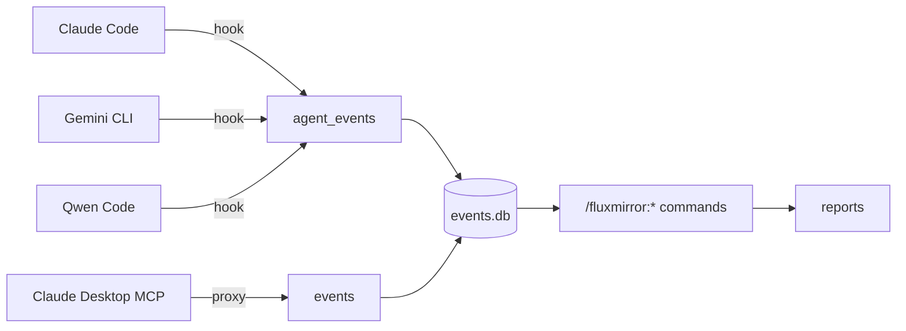

# fluxmirror

Multi-agent activity audit. Logs every tool call from Claude Code, Gemini
CLI, and Qwen Code to a SQLite database — separated by agent. Optionally
audits Claude Desktop's MCP traffic via a Rust proxy that writes to the
same DB.

A set of `/fluxmirror:*` slash commands (installed by the Claude/Qwen
plugin) turns the SQLite data into daily, weekly, or per-agent reports.

The per-tool-call hook (`fluxmirror-hook`) and the long-running MCP
proxy (`fluxmirror-proxy`) are single-binary Rust programs with zero
runtime dependencies (SQLite is statically linked). A tiny ~25-line
bash wrapper (`hooks/run-hook.sh`) auto-downloads the per-arch binary
from the latest GitHub release on first invocation and execs it on
every call — first call is one-time ~1-2 s, every call after is ~30 ms.

## Why

When you use multiple AI coding agents during a day, your activity is
fragmented across each tool's local state. fluxmirror gives you a single
queryable record per agent, with no cross-contamination — useful for
daily journals, billing review, security audits, or just understanding
how you actually work.

## Architecture



All four sources flow into a single SQLite database at
`~/Library/Application Support/fluxmirror/events.db`. The hook-based
agents write to the `agent_events` table; `fluxmirror-proxy` (the Rust
stdio proxy used by Claude Desktop) writes to the `events` table. The
slash command surface (`/fluxmirror:today`, `/fluxmirror:week`,
`/fluxmirror:agent <name>`, etc.) queries both.

The agent label per row is determined automatically:

| CLI         | `agent_events.agent` | JSONL path                |
|-------------|----------------------|----------------------------|
| Claude Code | `claude-code`        | `~/.claude/session-logs/` |
| Qwen Code   | `qwen-code`          | `~/.qwen/session-logs/`   |
| Gemini CLI  | `gemini-cli`         | `~/.gemini/session-logs/` |

The Claude/Qwen distinction is detected at hook time via Qwen's
`$QWEN_CODE_NO_RELAUNCH` / `$QWEN_PROJECT_DIR` env signals.

## Requirements

- `bash` and `curl` on PATH (both universal on macOS / Linux / WSL)
- Network access on first hook invocation (one-time ~1-2 s download)
  per machine, per major version)

The Rust binaries themselves have **zero runtime dependencies** — SQLite
is statically linked into them.

## Install

Choose the agents you use.

### Claude Code

```bash
/plugin marketplace add OpenFluxGate/fluxmirror
/plugin install fluxmirror@fluxmirror
```

Details: [plugins/fluxmirror/README.md](plugins/fluxmirror/README.md).

### Qwen Code

Qwen accepts Claude marketplace plugins directly:

```bash
qwen extensions install OpenFluxGate/fluxmirror:fluxmirror
```

The same plugin handles both. The hook auto-labels rows `qwen-code`
when running under Qwen.

> Note: Qwen's installer prompts `Do you want to continue? [Y/n]:` and
> has no `--yes` flag. For non-interactive installs:
> ```bash
> echo y | qwen extensions install OpenFluxGate/fluxmirror:fluxmirror
> ```

### Gemini CLI

```bash
gemini extensions install OpenFluxGate/fluxmirror \
  --ref gemini-extension-pkg --consent
```

The `gemini-extension-pkg` branch is auto-published by `release.yml`
on every tag and contains `gemini-extension/*` at the repo root —
Gemini's installer requires the manifest at the root of the URL it
clones from. The `--consent` flag skips the interactive confirmation.

Details: [gemini-extension/README.md](gemini-extension/README.md).

### Claude Desktop (MCP audit)

Download the per-arch binary from the latest release. Pick the right
asset for your machine:

| OS / arch | Asset |
|---|---|
| macOS Apple Silicon | `fluxmirror-proxy-darwin-arm64` |
| macOS Intel | `fluxmirror-proxy-darwin-x64` |
| Linux x86_64 | `fluxmirror-proxy-linux-x64` |
| Linux ARM64 | `fluxmirror-proxy-linux-arm64` |
| Windows x86_64 | `fluxmirror-proxy-windows-x64.exe` |

```bash
curl -L -o ~/fluxmirror-proxy \
  https://github.com/OpenFluxGate/fluxmirror/releases/latest/download/fluxmirror-proxy-darwin-arm64
chmod +x ~/fluxmirror-proxy
```

See [plugins/fluxmirror/README.md](plugins/fluxmirror/README.md) for the
Claude Desktop config snippet.

## Daily reports

Once data is flowing, use the slash command surface inside any of the
installed CLIs (the commands ship with the Claude/Qwen plugin):

```
/fluxmirror:about            # explainer + auto-discovered command list
/fluxmirror:today            # today's report
/fluxmirror:yesterday        # yesterday
/fluxmirror:week             # last 7 days, daily breakdown
/fluxmirror:compare          # today vs yesterday side-by-side
/fluxmirror:agent <name>     # single-agent filtered report
                             # name is one of: claude-code, gemini-cli, qwen-code
/fluxmirror:setup ...        # configure language and timezone
```

Reports normalize tool names across both Claude PascalCase
(`Edit`/`Write`/`Read`/`Bash`) and Gemini/Qwen snake_case
(`edit_file`/`write_file`/`read_file`/`run_shell_command`), so a single
report covers all agents uniformly.

## Configuration (optional env vars)

| Variable               | Effect                                              |
|------------------------|------------------------------------------------------|
| `FLUXMIRROR_DB`        | Override DB path (default: `~/Library/Application Support/fluxmirror/events.db`) |
| `FLUXMIRROR_SKIP_SELF` | If `1`, combined with `FLUXMIRROR_SELF_REPO`, skips events that look like fluxmirror querying its own DB from inside its own repo. Useful when self-developing fluxmirror so reports don't fill with self-noise. |
| `FLUXMIRROR_SELF_REPO` | Absolute path to the fluxmirror repo for the filter above. Anchored prefix match — adjacent dirs with similar names are not falsely filtered. |

Hook-side errors (e.g., DB locked, helper script missing) are appended
to `~/.fluxmirror/hook-errors.log`. The log is auto-rotated when it
exceeds 5 MiB (one backup `.log.1` is kept), so disk usage stays bounded.

## Verify

After installing on a new machine, confirm logs are isolated per agent
at both the JSONL and SQLite layers:

```bash
./scripts/verify-isolation.sh
```

The script runs five checks:
1. JSONL file presence + line counts per agent
2. Unique session IDs per JSONL file
3. Cross-contamination check across all 6 directional pairs
4. Tool-name distribution per agent
5. **SQLite `agent_events` isolation** — verifies no `session_id` is
   shared across agents in the DB

Expected: `clean (0 session IDs cross over)` for all checks.

For an at-a-glance count of rows per agent in the DB:

```bash
sqlite3 "$HOME/Library/Application Support/fluxmirror/events.db" \
  "SELECT agent, COUNT(*) FROM agent_events GROUP BY agent"
```

## Updating

### Claude Code

Third-party marketplaces don't auto-update by default. To enable
automatic updates:

1. Run `/plugin` inside Claude Code
2. Select fluxmirror marketplace, then click **Enable auto-update**

For manual updates:

```bash
/plugin marketplace update fluxmirror
/reload-plugins
```

### Gemini CLI

```bash
gemini extensions update fluxmirror
```

### Qwen Code

```bash
qwen extensions update fluxmirror
```

### Claude Desktop (MCP proxy)

Re-download the per-arch binary (replace `darwin-arm64` with your
machine's asset suffix from the install table above):

```bash
curl -L -o ~/fluxmirror-proxy \
  https://github.com/OpenFluxGate/fluxmirror/releases/latest/download/fluxmirror-proxy-darwin-arm64
chmod +x ~/fluxmirror-proxy
```

## Repository layout

```
fluxmirror/
├── rust-hook/                        Single-binary tool-call hook (Rust)
│   ├── src/main.rs                   Logic for all 3 agent CLIs
│   └── Cargo.toml
├── rust-proxy/                       Long-running MCP proxy (Rust)
│   ├── src/                          {cli, framer, store, writer, child, bridge, main}.rs
│   └── Cargo.toml
├── plugins/fluxmirror/               Claude Code plugin (also used by Qwen)
│   ├── hooks/run-hook.sh             ~25-line auto-download wrapper
│   └── commands/                     /fluxmirror:* slash command surface
├── gemini-extension/                 Gemini CLI extension
│   └── hooks/run-hook.sh             same auto-download wrapper
├── scripts/
│   ├── verify-isolation.sh           JSONL + SQLite isolation verification
│   ├── test-rust-hook.sh             Rust hook regression suite
│   └── bump-version.sh               release helper (sync 3 manifests + tag)
├── .github/workflows/
│   ├── test.yml                      CI: cargo test + Rust regression + integration
│   ├── release.yml                   CI on tag: gemini-extension archive + branch
│   └── rust-release.yml              CI on tag: per-arch Rust binaries (5 × 2)
└── .claude-plugin/                   Claude marketplace manifest
```

## Contributing

```bash
cd rust-hook && cargo build --release    # → target/release/fluxmirror-hook  (~1.2 MB)
cd rust-proxy && cargo build --release   # → target/release/fluxmirror-proxy (~1.2 MB)
```

See [rust-hook/README.md](rust-hook/README.md) and
[rust-proxy/README.md](rust-proxy/README.md) for design notes.

### Tests

| Suite | What it covers | How to run |
|---|---|---|
| Rust hook unit | per-tool detail extraction, time formatting | `cd rust-hook && cargo test --release` (14 cases) |
| Rust hook regression | full black-box test of the binary | `./scripts/test-rust-hook.sh` (20 cases) |
| Rust proxy unit | CLI parsing, NDJSON framer, SQLite store | `cd rust-proxy && cargo test --release` (15 cases) |
| Rust proxy integration | `fluxmirror-proxy` + `cat` child end-to-end | runs in CI; see `.github/workflows/test.yml` |
| JSONL+SQLite isolation | session IDs do not leak across agents | `./scripts/verify-isolation.sh` |

`.github/workflows/test.yml` runs all of the above on every push to
`main` and every pull request, in two parallel jobs (rust-hook,
rust-proxy).

## Releasing (maintainers)

```bash
./scripts/bump-version.sh 0.5.1     # bumps all 3 manifests + commits + tags
git push origin main v0.5.1
```

`scripts/bump-version.sh` updates **all three repo manifests** in one
commit (`gemini-extension/gemini-extension.json`,
`plugins/fluxmirror/.claude-plugin/plugin.json`, and the nested
`.plugins[].version` in `.claude-plugin/marketplace.json`) and creates
the matching annotated tag. It refuses to run if the working tree is
dirty, you're not on `main`, or the tag already exists. Pass
`--dry-run` to preview the diff without changing anything.

The tag push then triggers three workflows in parallel:

- **`release.yml`** — re-syncs versions (defensive, idempotent), strips
  AppleDouble metadata, packages the gemini-extension tarball,
  publishes a GitHub release with the archive attached, **and
  force-pushes a `gemini-extension-pkg` branch** that contains
  `gemini-extension/*` at the repo root (so Gemini CLI's installer
  works against this repo via `--ref gemini-extension-pkg`).
- **`rust-release.yml`** — matrix-builds **two binaries**
  (`fluxmirror-hook`, `fluxmirror-proxy`) for **five targets** (linux
  x64/arm64, darwin x64/arm64, windows x64) and uploads all 10 assets
  to the same release.
- **`test.yml`** — re-runs the bash + Rust + integration test suites
  on the new tag commit.

To trigger a dry run of the matrix builds without tagging, use
GitHub's **Run workflow** button on `rust-release.yml`
(workflow_dispatch).

## License

MIT
