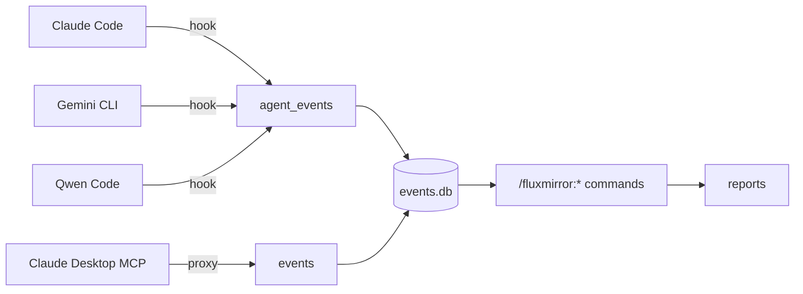

# fluxmirror

Multi-agent activity audit. Logs every tool call from Claude Code, Gemini
CLI, and Qwen Code to a daily JSONL file **and** a shared SQLite database
— separated by agent. Optionally audits Claude Desktop's MCP traffic via
a Java proxy that writes to the same DB.

A set of `/fluxmirror:*` slash commands (installed by the Claude/Qwen
plugin) turns the SQLite data into daily, weekly, or per-agent reports.

## Why

When you use multiple AI coding agents during a day, your activity is
fragmented across each tool's local state. fluxmirror gives you a single
queryable record per agent, with no cross-contamination — useful for
daily journals, billing review, security audits, or just understanding
how you actually work.

## Architecture



All four sources flow into a single SQLite database at
`~/Library/Application Support/fluxmirror/events.db`. The hook-based
agents write to the `agent_events` table; the Java MCP proxy for Claude
Desktop writes to the `events` table. The slash command surface
(`/fluxmirror:today`, `/fluxmirror:week`, `/fluxmirror:agent <name>`,
etc.) queries both.

The agent label per row is determined automatically:

| CLI         | `agent_events.agent` | JSONL path                |
|-------------|----------------------|----------------------------|
| Claude Code | `claude-code`        | `~/.claude/session-logs/` |
| Qwen Code   | `qwen-code`          | `~/.qwen/session-logs/`   |
| Gemini CLI  | `gemini-cli`         | `~/.gemini/session-logs/` |

The Claude/Qwen distinction is detected at hook time via Qwen's
`$QWEN_CODE_NO_RELAUNCH` / `$QWEN_PROJECT_DIR` env signals.

## Requirements

- `jq` on PATH (`brew install jq`)
- `python3` on PATH (used by the hook's safe parameter-bound SQLite
  writer; ships with Xcode CLT on macOS)
- Java 21 — **only** if using the Claude Desktop MCP proxy
  (`sdk install java 21.0.10-zulu`)

## Install

Choose the agents you use.

### Claude Code

```bash
/plugin marketplace add OpenFluxGate/fluxmirror
/plugin install fluxmirror@fluxmirror
```

Details: [plugins/fluxmirror/README.md](plugins/fluxmirror/README.md).

### Qwen Code

Qwen accepts Claude marketplace plugins directly:

```bash
qwen extensions install OpenFluxGate/fluxmirror:fluxmirror
```

The same plugin handles both. The hook auto-labels rows `qwen-code`
when running under Qwen.

### Gemini CLI

```bash
gemini extensions install https://github.com/OpenFluxGate/fluxmirror
```

Details: [gemini-extension/README.md](gemini-extension/README.md).

### Claude Desktop (MCP audit)

Download the latest jar:

```bash
curl -L -o ~/fluxmirror-mcp-proxy.jar \
  https://github.com/OpenFluxGate/fluxmirror/releases/latest/download/fluxmirror-mcp-proxy.jar
```

See [plugins/fluxmirror/README.md](plugins/fluxmirror/README.md) for the
Claude Desktop config snippet.

## Daily reports

Once data is flowing, use the slash command surface inside any of the
installed CLIs (the commands ship with the Claude/Qwen plugin):

```
/fluxmirror:about            # explainer + auto-discovered command list
/fluxmirror:today            # today's report
/fluxmirror:yesterday        # yesterday
/fluxmirror:week             # last 7 days, daily breakdown
/fluxmirror:compare          # today vs yesterday side-by-side
/fluxmirror:agent <name>     # single-agent filtered report
                             # name is one of: claude-code, gemini-cli, qwen-code
/fluxmirror:setup ...        # configure language and timezone
```

Reports normalize tool names across both Claude PascalCase
(`Edit`/`Write`/`Read`/`Bash`) and Gemini/Qwen snake_case
(`edit_file`/`write_file`/`read_file`/`run_shell_command`), so a single
report covers all agents uniformly.

## Configuration (optional env vars)

| Variable               | Effect                                              |
|------------------------|------------------------------------------------------|
| `FLUXMIRROR_DB`        | Override DB path (default: `~/Library/Application Support/fluxmirror/events.db`) |
| `FLUXMIRROR_SKIP_SELF` | If `1`, combined with `FLUXMIRROR_SELF_REPO`, skips events that look like fluxmirror querying its own DB from inside its own repo. Useful when self-developing fluxmirror so reports don't fill with self-noise. |
| `FLUXMIRROR_SELF_REPO` | Absolute path to the fluxmirror repo for the filter above. Anchored prefix match — adjacent dirs with similar names are not falsely filtered. |

Hook-side errors (e.g., DB locked, helper script missing) are appended
to `~/.fluxmirror/hook-errors.log`. The log is auto-rotated when it
exceeds 5 MiB (one backup `.log.1` is kept), so disk usage stays bounded.

## Verify

After installing on a new machine, confirm logs are isolated per agent
at both the JSONL and SQLite layers:

```bash
./scripts/verify-isolation.sh
```

The script runs five checks:
1. JSONL file presence + line counts per agent
2. Unique session IDs per JSONL file
3. Cross-contamination check across all 6 directional pairs
4. Tool-name distribution per agent
5. **SQLite `agent_events` isolation** — verifies no `session_id` is
   shared across agents in the DB

Expected: `clean (0 session IDs cross over)` for all checks.

For an at-a-glance count of rows per agent in the DB:

```bash
sqlite3 "$HOME/Library/Application Support/fluxmirror/events.db" \
  "SELECT agent, COUNT(*) FROM agent_events GROUP BY agent"
```

## Updating

### Claude Code

Third-party marketplaces don't auto-update by default. To enable
automatic updates:

1. Run `/plugin` inside Claude Code
2. Select fluxmirror marketplace, then click **Enable auto-update**

For manual updates:

```bash
/plugin marketplace update fluxmirror
/reload-plugins
```

### Gemini CLI

```bash
gemini extensions update fluxmirror
```

### Qwen Code

```bash
qwen extensions update fluxmirror
```

### Claude Desktop (MCP proxy)

Re-download the latest jar:

```bash
curl -L -o ~/fluxmirror-mcp-proxy.jar \
  https://github.com/OpenFluxGate/fluxmirror/releases/latest/download/fluxmirror-mcp-proxy.jar
```

## Repository layout

```
fluxmirror/
├── src/                              Java MCP proxy (for Claude Desktop)
├── plugins/fluxmirror/               Claude Code plugin (also used by Qwen)
│   ├── hooks/session-log.sh          PostToolUse hook
│   ├── hooks/_dual_write.py          Helper copy (synced from canonical)
│   └── commands/                     /fluxmirror:* slash command surface
├── gemini-extension/                 Gemini CLI extension
│   ├── hooks/session-log.sh          AfterTool hook
│   └── hooks/_dual_write.py          Helper copy (synced from canonical)
├── scripts/
│   ├── _dual_write.py                Canonical safe SQLite writer
│   ├── verify-isolation.sh           JSONL + SQLite isolation verification
│   └── test-hooks.sh                 Synthetic hook regression suite
├── Makefile                          sync-helpers / verify-helpers targets
├── .github/workflows/test.yml        CI: bash -n + verify-helpers + test-hooks
├── .github/workflows/release.yml     CI: tag → packaged release
└── .claude-plugin/                   Claude marketplace manifest
```

## Contributing

The shared SQLite writer lives at `scripts/_dual_write.py` (canonical).
Each install package (`plugins/fluxmirror/hooks/`, `gemini-extension/hooks/`)
ships its own copy so installs are self-contained. To keep them in sync
after editing the canonical:

```bash
make sync-helpers     # copy canonical into both packages
make verify-helpers   # CI uses this — fails if any copy diverged
```

The CI workflow at `.github/workflows/test.yml` runs `verify-helpers`
plus `scripts/test-hooks.sh` (20 synthetic test cases covering tool
detection, agent labeling, self-noise filter, round-trip raw_json) on
every push to `main` and every pull request.

To run the same tests locally:

```bash
./scripts/test-hooks.sh
```

## Releasing (maintainers)

```bash
# 1. Bump version in gemini-extension/gemini-extension.json and
#    plugins/fluxmirror/.claude-plugin/plugin.json
# 2. Push a matching tag
git tag vX.Y.Z
git push origin vX.Y.Z
```

Pushing the tag triggers `.github/workflows/release.yml`, which builds
the gemini-extension archive and publishes a GitHub release with the
archive attached.

## License

MIT
