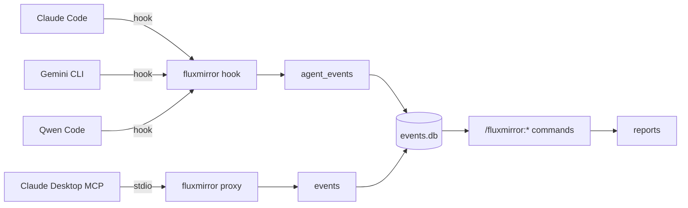

# fluxmirror

Multi-agent activity audit. Logs every tool call from Claude Code,
Gemini CLI, and Qwen Code to a SQLite database — separated by agent.
Optionally audits Claude Desktop's MCP traffic via the same binary
running as a long-running stdio proxy that writes to the same DB.

A set of `/fluxmirror:*` slash commands (installed by the Claude Code /
Qwen Code plugin and the Gemini CLI extension) turns the SQLite data
into daily, weekly, or per-agent reports.

Phase 1 ships **a single `fluxmirror` binary** with a kubectl-style
subcommand surface — `fluxmirror hook`, `fluxmirror proxy`, `fluxmirror
init`, `fluxmirror today`, `fluxmirror doctor`, … — replacing the
previous two-binary layout. The binary is a statically-linked Rust
program with zero runtime dependencies (SQLite is bundled). A small
cross-shell wrapper layer (`wrappers/{shim.sh, shim.mjs, shim.cmd,
router.sh}`) auto-downloads the per-arch binary on first invocation
and execs it on every call — first call is one-time ~1-2 s, every call
after is ~30 ms.

## Why

When you use multiple AI coding agents during a day, your activity is
fragmented across each tool's local state. fluxmirror gives you a single
queryable record per agent, with no cross-contamination — useful for
daily journals, billing review, security audits, or just understanding
how you actually work.

## Architecture



All four sources flow into a single SQLite database. The hook-driven
agents write to the `agent_events` table; `fluxmirror proxy` (the
stdio MCP relay used by Claude Desktop) writes to the `events` table.
The slash command surface queries both. See
[docs/architecture.md](docs/architecture.md) for the layered model and
crate map; the four ADRs in [docs/adr/](docs/adr/) capture the design
decisions.

The agent label per row is determined automatically:

| CLI         | `agent_events.agent` | JSONL path                |
|-------------|----------------------|----------------------------|
| Claude Code | `claude-code`        | `~/.claude/session-logs/` |
| Qwen Code   | `qwen-code`          | `~/.qwen/session-logs/`   |
| Gemini CLI  | `gemini-cli`         | `~/.gemini/session-logs/` |

The Claude / Qwen distinction is detected at hook time via Qwen's
`$QWEN_CODE_NO_RELAUNCH` / `$QWEN_PROJECT_DIR` env signals.

Per-OS default DB path (created lazily on first write):

| OS | Path |
|---|---|
| macOS | `~/Library/Application Support/fluxmirror/events.db` |
| Linux | `${XDG_DATA_HOME:-~/.local/share}/fluxmirror/events.db` |
| Windows | `%APPDATA%\fluxmirror\events.db` |

## Requirements

For the wrapper layer, **one** of the following per host (already
present on every supported OS):

- `bash` + `curl` — macOS, Linux, WSL, Git-Bash on Windows
- `node` ≥ 18 — any host with Node, including PowerShell-only Windows
- `cmd.exe` + PowerShell — native Windows without Node

Network access on first hook invocation (one-time ~1-2 s download per
machine, per major version). The Rust binary itself has **zero runtime
dependencies** — SQLite is statically linked.

## Install

Choose the agents you use.

### Claude Code

```bash
/plugin marketplace add OpenFluxGate/fluxmirror
/plugin install fluxmirror@fluxmirror
```

Details: [plugins/fluxmirror/README.md](plugins/fluxmirror/README.md).

### Qwen Code

Qwen accepts Claude marketplace plugins directly:

```bash
qwen extensions install OpenFluxGate/fluxmirror:fluxmirror
```

The same plugin handles both. The hook auto-labels rows `qwen-code`
when running under Qwen.

> Qwen's installer prompts `Do you want to continue? [Y/n]:` and has no
> `--yes` flag. For non-interactive installs:
> ```bash
> echo y | qwen extensions install OpenFluxGate/fluxmirror:fluxmirror
> ```

### Gemini CLI

```bash
gemini extensions install https://github.com/OpenFluxGate/fluxmirror \
  --ref gemini-extension-pkg \
  --consent
```

All three parts are required: the full `https://` URL (the
`owner/repo` shorthand is not accepted), the `--ref
gemini-extension-pkg` (the auto-published branch that contains
`gemini-extension/*` at the repo root so the installer finds the
manifest), and `--consent` (skips the interactive prompt). Details
and troubleshooting table:
[gemini-extension/README.md](gemini-extension/README.md).

### Direct binary (Claude Desktop MCP audit, or any other use)

Either build from source:

```bash
cargo install --path crates/fluxmirror-cli
```

Or download the per-arch binary from the latest release:

| OS / arch | Asset |
|---|---|
| macOS Apple Silicon | `fluxmirror-darwin-arm64` |
| macOS Intel | `fluxmirror-darwin-x64` |
| Linux x86_64 | `fluxmirror-linux-x64` |
| Linux ARM64 | `fluxmirror-linux-arm64` |
| Windows x86_64 | `fluxmirror-windows-x64.exe` |

```bash
curl -L -o ~/fluxmirror \
  https://github.com/OpenFluxGate/fluxmirror/releases/latest/download/fluxmirror-darwin-arm64
chmod +x ~/fluxmirror
```

For Claude Desktop MCP audit, point `claude_desktop_config.json` at
`~/fluxmirror proxy --server-name <name> --db <path> -- <real MCP
server>`. Snippet in
[plugins/fluxmirror/README.md](plugins/fluxmirror/README.md).

## First-run flow

After installing any plugin / extension:

```bash
fluxmirror init             # interactive (Tier A: language + timezone)
fluxmirror init --advanced  # also asks retention / self-noise / per-agent
fluxmirror init --non-interactive --language=korean --timezone=Asia/Seoul
```

Then trigger any tool call from Claude Code / Qwen Code / Gemini CLI.
The first successful insert writes a `welcome.md` next to the config.
Run `fluxmirror doctor` at any point to see a 5-component health
table.

## Slash commands

Once data is flowing, use any of these inside any of the installed
CLIs:

**Reports**

```
/fluxmirror:about             explainer + auto-discovered command list
/fluxmirror:today             today's report
/fluxmirror:yesterday         yesterday
/fluxmirror:week              last 7 days, daily breakdown
/fluxmirror:compare           today vs yesterday side-by-side
/fluxmirror:agent <name>      single-agent filtered report
                              (claude-code, gemini-cli, qwen-code)
/fluxmirror:agents            per-agent 7-day totals + dominant tools
```

**Configuration**

```
/fluxmirror:setup             configure language and timezone
/fluxmirror:language          set output language
/fluxmirror:timezone          set timezone
/fluxmirror:config            show / get / set / explain config
```

**Health**

```
/fluxmirror:doctor            5-component health table
```

Reports normalize tool names across both Claude PascalCase
(`Edit`/`Write`/`Read`/`Bash`) and Gemini / Qwen snake_case
(`edit_file`/`write_file`/`read_file`/`run_shell_command`), so a single
report covers all agents uniformly.

## Configuration

Layered, **highest priority first**:

```
CLI flags
  > env vars
    > project ./.fluxmirror.toml
      > user config (~/.fluxmirror/config.json on macOS,
                     ${XDG_CONFIG_HOME:-~/.config}/fluxmirror/config.json on Linux,
                     %APPDATA%\fluxmirror\config.json on Windows)
        > inferred defaults
```

Useful environment variables:

| Variable | Effect |
|---|---|
| `FLUXMIRROR_DB` | Override DB path |
| `FLUXMIRROR_SKIP_SELF` | If `1`, combined with `FLUXMIRROR_SELF_REPO`, skips events that look like fluxmirror querying its own DB from inside its own repo. Useful when self-developing fluxmirror so reports don't fill with self-noise. |
| `FLUXMIRROR_SELF_REPO` | Absolute path to the fluxmirror repo for the filter above. Anchored prefix match — adjacent dirs with similar names are not falsely filtered. |

Hook-side errors (e.g., DB locked) are appended to
`~/.fluxmirror/hook-errors.log`. The log auto-rotates when it exceeds
5 MiB (one backup `.log.1` is kept), so disk usage stays bounded.

## Migrating from v0.5.x

If you previously installed FluxMirror v0.5.x (the two-binary layout),
the v0.6 release publishes legacy `fluxmirror-hook-<arch>` and
`fluxmirror-proxy-<arch>` asset names as copies of the new single
binary, so existing wrappers continue to work. Run `fluxmirror init`
to migrate to the new wrapper layer (`shim.sh` / `shim.mjs` /
`shim.cmd` chosen automatically). The on-disk schema upgrades in
place: the v1 migration is purely additive (`ALTER TABLE … ADD
COLUMN`) and runs automatically on the first connection.

## Verify

After installing on a new machine, confirm logs are isolated per agent
at both the JSONL and SQLite layers:

```bash
./scripts/verify-isolation.sh
```

The script runs five checks: JSONL file presence + counts per agent,
unique session IDs per JSONL file, cross-contamination across all 6
directional pairs, tool-name distribution per agent, and SQLite
`agent_events` isolation (no `session_id` shared across agents).
Expected: `clean (0 session IDs cross over)` for all checks.

For an at-a-glance per-agent row count:

```bash
fluxmirror sqlite --db "$(fluxmirror db-path)" \
  "SELECT agent, COUNT(*) FROM agent_events GROUP BY agent"
```

## Updating

| Surface | Command |
|---|---|
| Claude Code | `/plugin marketplace update fluxmirror` then `/reload-plugins` (or enable auto-update under `/plugin`) |
| Qwen Code | `qwen extensions update fluxmirror` |
| Gemini CLI | `gemini extensions update fluxmirror` |
| Direct binary | re-download the per-arch asset and overwrite |

## Repository layout

```
fluxmirror/
├── CLAUDE.md                              project instructions (attribution policy at top)
├── README.md                              this file
├── LICENSE                                MIT
├── Cargo.toml                             workspace manifest
├── crates/
│   ├── fluxmirror-cli/                    [[bin]] fluxmirror — clap dispatcher
│   ├── fluxmirror-core/                   Event, normalize, Config, paths, tz
│   ├── fluxmirror-store/                  EventStore trait + SqliteStore
│   └── fluxmirror-proxy/                  stdio MCP relay (lib)
├── wrappers/
│   ├── shim.sh                            bash entry (macOS / Linux / WSL / Git-Bash)
│   ├── shim.mjs                           Node entry (PowerShell-only Windows etc.)
│   ├── shim.cmd                           cmd.exe entry (Node-less Windows)
│   └── router.sh                          tries shims in priority order (pre-init)
├── manifests/
│   └── source.yaml                        single source of truth for hooks.json
├── plugins/fluxmirror/                    Claude Code plugin (also used by Qwen)
│   ├── .claude-plugin/plugin.json
│   ├── hooks/                             hooks.json (generated) + run-hook.sh wrapper
│   └── commands/                          /fluxmirror:* slash commands (.md)
├── gemini-extension/                      Gemini CLI extension
│   ├── gemini-extension.json
│   ├── hooks/                             hooks.json (generated) + run-hook.sh wrapper
│   └── commands/                          /fluxmirror:* slash commands (.toml)
├── docs/
│   ├── architecture.md                    layered model + crate map + roadmap
│   └── adr/000{1..4}*.md                  design decisions
├── scripts/
│   ├── verify-isolation.sh                JSONL + SQLite isolation verification
│   ├── test-rust-hook.sh                  hook regression suite (parity test)
│   ├── build-manifests.sh                 emit hooks.json from manifests/source.yaml (--check in CI)
│   └── bump-version.sh                    release helper (sync workspace + 3 plugin manifests + tag)
├── .github/workflows/
│   ├── test.yml                           CI on push/PR (3-OS matrix, manifest check, parity test)
│   ├── release.yml                        CI on tag: gemini-extension archive + branch
│   └── rust-release.yml                   CI on tag: per-arch single binary (5 targets)
├── .claude-plugin/
│   └── marketplace.json                   Claude marketplace listing
└── .omc/autopilot/{spec,plan,progress}.md durable autopilot state
```

## Development

```bash
cargo build --workspace --release        # → target/release/fluxmirror (~2.2 MB)
cargo test --workspace                   # full workspace test suite
bash scripts/test-rust-hook.sh           # black-box hook parity test
bash scripts/build-manifests.sh --check  # CI guard: hooks.json must match source.yaml
```

`.github/workflows/test.yml` runs the workspace test suite on
`ubuntu-latest`, `macos-latest`, and `windows-latest` on every push to
`main` and every pull request, plus the wrapper syntax checks
(`bash -n` / `node --check`), the manifest drift guard, the hook
parity suite, and a grep guard that blocks any slash command from
reintroducing the legacy interpreter / sqlite-CLI shell calls that
Phase 0 removed.

## Releasing (maintainers)

```bash
./scripts/bump-version.sh 0.6.0     # syncs workspace + 3 plugin manifests + commits + tags
git push origin main v0.6.0
```

`bump-version.sh` updates the workspace `Cargo.toml`
`[workspace.package].version`, the three plugin manifests
(`gemini-extension/gemini-extension.json`,
`plugins/fluxmirror/.claude-plugin/plugin.json`, and the nested
`.plugins[].version` in `.claude-plugin/marketplace.json`), and
creates the matching annotated tag. It refuses to run on a dirty
working tree, off `main`, or if the tag already exists. Pass
`--dry-run` to preview the diff without changing anything.

The tag push triggers three workflows in parallel:

- **`release.yml`** — re-syncs versions defensively, packages the
  gemini-extension tarball (now including `wrappers/`), publishes a
  GitHub release with the archive attached, and force-pushes the
  `gemini-extension-pkg` branch with `gemini-extension/*` plus
  `wrappers/` at the root.
- **`rust-release.yml`** — matrix-builds the single `fluxmirror`
  binary for five targets (linux x64/arm64, darwin x64/arm64, windows
  x64) and uploads each as `fluxmirror-<arch>{,.exe}` plus the legacy
  `fluxmirror-hook-<arch>` and `fluxmirror-proxy-<arch>` aliases (the
  same binary, copied) so existing wrappers keep working.
- **`test.yml`** — re-runs the workspace test matrix on the new tag
  commit.

To trigger a dry run of the matrix builds without tagging, use
GitHub's **Run workflow** button on `rust-release.yml`
(workflow_dispatch).

## License

MIT
