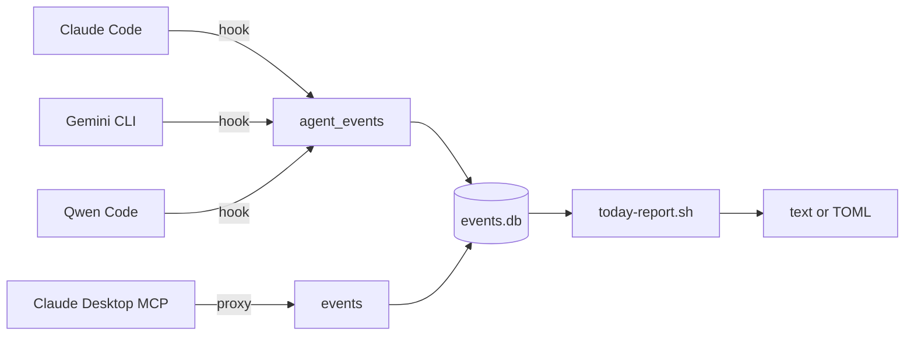

# fluxmirror

Multi-agent activity audit. Logs every tool call from Claude Code, Gemini
CLI, and Qwen Code to a daily JSONL file, separated by agent. Optionally
audits Claude Desktop's MCP traffic via a Java proxy.

## Why

When you use multiple AI coding agents during a day, your activity is
fragmented across each tool's local state. fluxmirror gives you a single
queryable record per agent, with no cross-contamination — useful for
daily journals, billing review, security audits, or just understanding
how you actually work.

## Architecture



All four sources flow into a single SQLite database at
`~/Library/Application Support/fluxmirror/events.db`. The hook-based agents
(Claude Code, Gemini CLI, Qwen Code) write to the `agent_events` table; the
Java MCP proxy for Claude Desktop writes to the `events` table. The
`today-report` command queries both and produces a unified daily summary.

## Requirements

- `jq` on PATH (for verification script and hooks): `brew install jq`
- Java 21 (only if using Claude Desktop MCP proxy): `sdk install java 21.0.10-zulu`

## Install

Choose the agents you use:

### Claude Code

```bash
/plugin marketplace add OpenFluxGate/fluxmirror
/plugin install fluxmirror@fluxmirror
```

Logs to `~/.claude/session-logs/YYYY-MM-DD.jsonl`. Details:
[plugins/fluxmirror/README.md](plugins/fluxmirror/README.md).

### Qwen Code

Qwen accepts Claude marketplace plugins directly:

```bash
qwen extensions install OpenFluxGate/fluxmirror:fluxmirror
```

Logs to `~/.qwen/session-logs/YYYY-MM-DD.jsonl`.

### Gemini CLI

```bash
gemini extensions install https://github.com/OpenFluxGate/fluxmirror
```

Logs to `~/.gemini/session-logs/YYYY-MM-DD.jsonl`. Details:
[gemini-extension/README.md](gemini-extension/README.md).

### Claude Desktop (MCP audit)

Download the latest jar:

```bash
curl -L -o ~/fluxmirror-mcp-proxy.jar \
  https://github.com/OpenFluxGate/fluxmirror/releases/latest/download/fluxmirror-mcp-proxy.jar
```

See [plugins/fluxmirror/README.md](plugins/fluxmirror/README.md) for the
Claude Desktop config snippet.

Requires Java 21 (`sdk install java 21.0.10-zulu`).

## Verify

After installing on a new machine, confirm logs are isolated per agent:

```bash
./scripts/verify-isolation.sh
```

Expected output: `clean (0 session IDs cross over)` for all 6 directional
checks (Claude→Gemini, Claude→Qwen, Gemini→Claude, Gemini→Qwen,
Qwen→Claude, Qwen→Gemini).

## Updating

### Claude Code

Third-party marketplaces don't auto-update by default. To enable automatic
updates for fluxmirror:

1. Run `/plugin` inside Claude Code
2. Select fluxmirror marketplace, then click Enable auto-update

For manual updates without auto-update enabled, run `claude`, then inside
Claude Code:

```bash
/plugin marketplace update fluxmirror
/reload-plugins
```

### Gemini CLI

```bash
gemini extensions update fluxmirror
```

### Qwen Code

```bash
qwen extensions update fluxmirror
```

### Claude Desktop (MCP proxy)

Re-download the latest jar:

```bash
curl -L -o ~/fluxmirror-mcp-proxy.jar https://github.com/OpenFluxGate/fluxmirror/releases/latest/download/fluxmirror-mcp-proxy.jar
```

## Requirements

- `jq` on PATH (for verification script and hooks): `brew install jq`
- Java 21 (only if using Claude Desktop MCP proxy): `sdk install java 21.0.10-zulu`

## Repository layout

```
fluxmirror/
├── src/                          Java MCP proxy (for Claude Desktop)
├── plugins/fluxmirror/           Claude Code plugin (also used by Qwen)
├── gemini-extension/             Gemini CLI extension
├── scripts/verify-isolation.sh   Isolation verification
└── .claude-plugin/               Claude marketplace manifest
```

## Releasing (maintainers)

```bash
# 1. Bump version in gemini-extension/gemini-extension.json
# 2. Push a matching tag
git tag vX.Y.Z
git push origin vX.Y.Z
```

Pushing the tag triggers `.github/workflows/release.yml`, which builds the
gemini-extension archive and publishes a GitHub release with the archive
attached. The Gemini CLI extension install command pulls from this release.

## License

MIT
