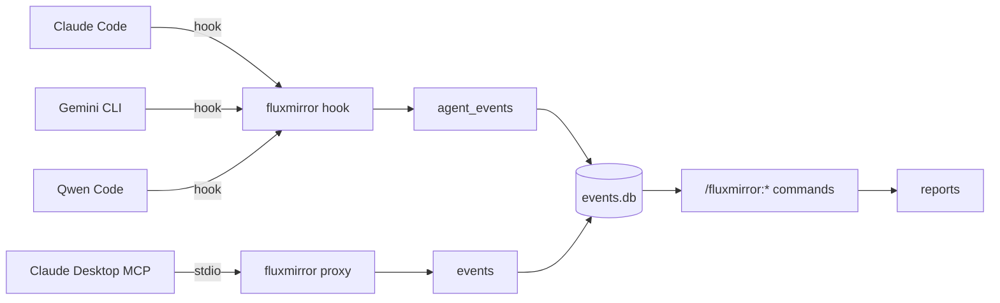

# fluxmirror

Multi-agent activity audit. Logs every tool call from Claude Code,
Gemini CLI, and Qwen Code to a SQLite database — separated by agent.
Optionally audits Claude Desktop's MCP traffic via the same binary
running as a long-running stdio proxy that writes to the same DB.

A set of `/fluxmirror:*` slash commands (installed by the Claude Code /
Qwen Code plugin and the Gemini CLI extension) turns the SQLite data
into daily, weekly, or per-agent reports.

**Two binaries.** Phase 1 + 2 shipped the `fluxmirror` binary — a
single statically-linked Rust program with a kubectl-style subcommand
surface (`fluxmirror hook`, `fluxmirror proxy`, `fluxmirror init`,
`fluxmirror today`, `fluxmirror week`, `fluxmirror doctor`, …) and zero
runtime dependencies (SQLite bundled). Phase 3 (in flight) adds a
second, **opt-in** binary — `fluxmirror-studio`, a local web dashboard
on `127.0.0.1:7090` that reads the same SQLite file in read-only mode.
You can run capture only, dashboard only, or both; the only thing they
share is the DB file. A small cross-shell wrapper layer
(`wrappers/{shim.sh, shim.mjs, shim.cmd, router.sh}`) auto-downloads
the per-arch capture binary on first invocation and execs it on every
call — first call is one-time ~1-2 s, every call after is ~30 ms.
The studio binary is installed and invoked directly by the user, never
through the wrapper layer.

## What FluxMirror produces

| # | Output | Status | Notes |
|---|---|---|---|
| 1 | Nightly journal | ✅ shipped | `/fluxmirror:today` and `fluxmirror today` produce a one-page activity report in your chosen language. Also available as HTML via `--html`. |
| 2 | Usage tracker | 🟡 partial | Tool-call counts, per-agent and per-tool breakdowns shipped via `/fluxmirror:agents` and `/fluxmirror:week`. Estimated API cost lands in Phase 3 M6. |
| 3 | Weekly digest | ✅ shipped | `/fluxmirror:week --html` produces the shareable HTML card with summary, daily breakdown, highlights, and insights. |
| 4 | Local web dashboard | 🚧 in flight | Phase 3 ships the `fluxmirror-studio` binary — provenance per file, time-machine replay, auto-named work sessions, cost overlay. Opt-in install. |
| 5 | AI synthesis layer | 🚧 in flight | Phase 4 adds the `fluxmirror-ai` crate — provider abstraction (Anthropic + Ollama-stub), SQLite cache, daily USD budget cap, prompt registry, outbound redaction. Capture binary deps unchanged. |
| 6 | Anomaly alerts | 🗺 roadmap | No detection or gating ships in Phase 1 / 2 / 3. Events are captured but not analysed. Phase 4 lands heuristic anomaly stories on top of the AI layer. |

Legend: ✅ shipped · 🟡 partial (core function works; one named gap) · 🗺 roadmap (not yet implemented)

## Values

| Value | Status | Notes |
|---|---|---|
| Transparency | ✅ | Every tool call is logged to a queryable SQLite DB; CLI + HTML + (Phase 3) web dashboard surface it in plain language. |
| Control | 🗺 roadmap | No policy engine, no gating, no rate-limiting. Phase 4 introduces heuristic anomaly stories; FluxGate integration is Phase 5. |
| Memory | 🚧 in flight | Phase 3 adds provenance per file + time-machine replay + auto-named sessions, turning the raw history into something you actually browse. |

## Why

When you use multiple AI coding agents during a day, your activity is
fragmented across each tool's local state. fluxmirror gives you a single
queryable record per agent, with no cross-contamination — useful for
daily journals, billing review, security audits, or just understanding
how you actually work.

## Architecture



All four sources flow into a single SQLite database. The hook-driven
agents write to the `agent_events` table; `fluxmirror proxy` (the
stdio MCP relay used by Claude Desktop) writes to the `events` table.
The slash command surface queries both. See
[docs/architecture.md](docs/architecture.md) for the layered model and
crate map; the four ADRs in [docs/adr/](docs/adr/) capture the design
decisions.

The agent label per row is determined automatically:

| CLI         | `agent_events.agent` | JSONL path                |
|-------------|----------------------|----------------------------|
| Claude Code | `claude-code`        | `~/.claude/session-logs/` |
| Qwen Code   | `qwen-code`          | `~/.qwen/session-logs/`   |
| Gemini CLI  | `gemini-cli`         | `~/.gemini/session-logs/` |

The Claude / Qwen distinction is detected at hook time via Qwen's
`$QWEN_CODE_NO_RELAUNCH` / `$QWEN_PROJECT_DIR` env signals.

Per-OS default DB path (created lazily on first write):

| OS | Path |
|---|---|
| macOS | `~/Library/Application Support/fluxmirror/events.db` |
| Linux | `${XDG_DATA_HOME:-~/.local/share}/fluxmirror/events.db` |
| Windows | `%APPDATA%\fluxmirror\events.db` |

## Requirements

The Rust binary itself has **zero runtime dependencies** — SQLite is
statically linked. The only requirements are (1) an OS-provided shell
runtime for the wrapper layer, and (2) at least one supported agent
CLI to actually capture hooks from.

### End user (just installing the plugin)

| What | Minimum version | Where it comes from |
|---|---|---|
| OS | macOS 11+ / Linux glibc 2.17+ / Windows 10+ (incl. WSL) | — |
| Shell runtime (one of) | `bash` + `curl` ≥ 7.50 **or** `node` ≥ 18 **or** `cmd.exe` + PowerShell ≥ 5.1 | All preinstalled on every supported OS |
| Network access | One-time ~3 MB download on first hook fire | github.com/OpenFluxGate/fluxmirror/releases |
| Disk | ~3 MB binary + bounded SQLite DB | `~/Library/Application Support/fluxmirror/` (macOS), `${XDG_DATA_HOME}/fluxmirror/` (Linux), `%APPDATA%\fluxmirror\` (Windows) |
| At least one agent CLI | Claude Code, Qwen Code, or Gemini CLI | See per-agent install below |

### Per-agent CLI (install whichever you use — at least one)

| Agent | Install | Hook event |
|---|---|---|
| Claude Code | https://claude.ai/code | `PostToolUse` |
| Qwen Code | `npm install -g @qwen-code/qwen-code` | `PostToolUse` (reuses Claude plugin) |
| Gemini CLI | `npm install -g @google/gemini-cli` | `AfterTool` |
| Claude Desktop (optional, MCP audit) | https://claude.ai/desktop | stdio MCP relay via `fluxmirror proxy` |

### Developer (building from source)

| What | Minimum version | Notes |
|---|---|---|
| Rust toolchain | stable, edition 2021 | `curl --proto '=https' --tlsv1.2 -sSf https://sh.rustup.rs \| sh` |
| C compiler | platform default | needed by `rusqlite` (bundled SQLite) — Xcode CLT on macOS, gcc on Linux, MSVC on Windows |
| `bash` + `node` | any | for `bash -n wrappers/shim.sh` and `node --check wrappers/shim.mjs` lint steps |
| `gh` CLI | optional | release tag pushes |

### Intentionally NOT required

JVM, Gradle, Java, Python, jq — all removed in earlier phases. Neither
end users nor developers need to install any of them.

## Install

Choose the agents you use.

### Claude Code

```bash
/plugin marketplace add OpenFluxGate/fluxmirror
/plugin install fluxmirror@fluxmirror
```

Details: [plugins/fluxmirror/README.md](plugins/fluxmirror/README.md).

### Qwen Code

Qwen accepts Claude marketplace plugins directly:

```bash
qwen extensions install OpenFluxGate/fluxmirror:fluxmirror
```

The same plugin handles both. The hook auto-labels rows `qwen-code`
when running under Qwen.

> Qwen's installer prompts `Do you want to continue? [Y/n]:` and has no
> `--yes` flag. For non-interactive installs:
> ```bash
> echo y | qwen extensions install OpenFluxGate/fluxmirror:fluxmirror
> ```

### Gemini CLI

```bash
gemini extensions install https://github.com/OpenFluxGate/fluxmirror \
  --ref gemini-extension-pkg \
  --consent
```

All three parts are required: the full `https://` URL (the
`owner/repo` shorthand is not accepted), the `--ref
gemini-extension-pkg` (the auto-published branch that contains
`gemini-extension/*` at the repo root so the installer finds the
manifest), and `--consent` (skips the interactive prompt). Details
and troubleshooting table:
[gemini-extension/README.md](gemini-extension/README.md).

### Direct binary (Claude Desktop MCP audit, or any other use)

Either build from source:

```bash
cargo install --path crates/fluxmirror-cli
```

Or download the per-arch binary from the latest release:

| OS / arch | Asset |
|---|---|
| macOS Apple Silicon | `fluxmirror-darwin-arm64` |
| macOS Intel | `fluxmirror-darwin-x64` |
| Linux x86_64 | `fluxmirror-linux-x64` |
| Linux ARM64 | `fluxmirror-linux-arm64` |
| Windows x86_64 | `fluxmirror-windows-x64.exe` |

```bash
curl -L -o ~/fluxmirror \
  https://github.com/OpenFluxGate/fluxmirror/releases/latest/download/fluxmirror-darwin-arm64
chmod +x ~/fluxmirror
```

For Claude Desktop MCP audit, point `claude_desktop_config.json` at
`~/fluxmirror proxy --server-name <name> --db <path> -- <real MCP
server>`. Snippet in
[plugins/fluxmirror/README.md](plugins/fluxmirror/README.md).

## First-run flow

After installing any plugin / extension:

```bash
fluxmirror init             # interactive (Tier A: language + timezone)
fluxmirror init --advanced  # also asks retention / self-noise / per-agent
fluxmirror init --non-interactive --language=korean --timezone=Asia/Seoul
```

Then trigger any tool call from Claude Code / Qwen Code / Gemini CLI.
The first successful insert writes a `welcome.md` next to the config.
Run `fluxmirror doctor` at any point to see a 5-component health
table.

## Slash commands

Once data is flowing, use any of these inside any of the installed
CLIs:

**Reports**

```
/fluxmirror:about             explainer + auto-discovered command list
/fluxmirror:today             today's report
/fluxmirror:yesterday         yesterday
/fluxmirror:week              last 7 days, daily breakdown
/fluxmirror:compare           today vs yesterday side-by-side
/fluxmirror:agent <name>      single-agent filtered report
                              (claude-code, gemini-cli, qwen-code)
/fluxmirror:agents            per-agent 7-day totals + dominant tools
```

**Configuration**

```
/fluxmirror:init              first-run interactive setup
                              (language, timezone, wrapper engine)
/fluxmirror:setup             configure language and timezone
/fluxmirror:language          set output language
/fluxmirror:timezone          set timezone
/fluxmirror:config            show / get / set / explain config
```

**Health**

```
/fluxmirror:doctor            5-component health table
```

Reports normalize tool names across both Claude PascalCase
(`Edit`/`Write`/`Read`/`Bash`) and Gemini / Qwen snake_case
(`edit_file`/`write_file`/`read_file`/`run_shell_command`), so a single
report covers all agents uniformly.

## Configuration

Layered, **highest priority first**:

```
CLI flags
  > env vars
    > project ./.fluxmirror.toml
      > user config (~/.fluxmirror/config.json on macOS,
                     ${XDG_CONFIG_HOME:-~/.config}/fluxmirror/config.json on Linux,
                     %APPDATA%\fluxmirror\config.json on Windows)
        > inferred defaults
```

Useful environment variables:

| Variable | Effect |
|---|---|
| `FLUXMIRROR_DB` | Override DB path |
| `FLUXMIRROR_SKIP_SELF` | If `1`, combined with `FLUXMIRROR_SELF_REPO`, skips events that look like fluxmirror querying its own DB from inside its own repo. Useful when self-developing fluxmirror so reports don't fill with self-noise. |
| `FLUXMIRROR_SELF_REPO` | Absolute path to the fluxmirror repo for the filter above. Anchored prefix match — adjacent dirs with similar names are not falsely filtered. |

Hook-side errors (e.g., DB locked) are appended to
`~/.fluxmirror/hook-errors.log`. The log auto-rotates when it exceeds
5 MiB (one backup `.log.1` is kept), so disk usage stays bounded.

## Migrating from v0.5.x

If you previously installed FluxMirror v0.5.x (the two-binary layout),
the v0.6 release publishes legacy `fluxmirror-hook-<arch>` and
`fluxmirror-proxy-<arch>` asset names as copies of the new single
binary, so existing wrappers continue to work. Run `fluxmirror init`
to migrate to the new wrapper layer (`shim.sh` / `shim.mjs` /
`shim.cmd` chosen automatically). The on-disk schema upgrades in
place: the v1 migration is purely additive (`ALTER TABLE … ADD
COLUMN`) and runs automatically on the first connection.

If your installed plugin is older than v0.6.0, it will have cached a
pre-subcommand binary under one of:

```
~/.claude/plugins/cache/fluxmirror/*/bin/
~/.qwen/extensions/fluxmirror/bin/
~/.gemini/extensions/fluxmirror/bin/
```

Evict that cache so the next hook fire downloads the v0.6+ binary:

```bash
rm -rf ~/.claude/plugins/cache/fluxmirror/*/bin
rm -rf ~/.qwen/extensions/fluxmirror/bin
rm -rf ~/.gemini/extensions/fluxmirror/bin
```

The wrapper scripts always re-download on a missing cache, so the next
agent tool call after the eviction will fetch the new binary
transparently.

## Verify

After installing on a new machine, confirm logs are isolated per agent
at both the JSONL and SQLite layers:

```bash
./scripts/verify-isolation.sh
```

The script runs five checks: JSONL file presence + counts per agent,
unique session IDs per JSONL file, cross-contamination across all 6
directional pairs, tool-name distribution per agent, and SQLite
`agent_events` isolation (no `session_id` shared across agents).
Expected: `clean (0 session IDs cross over)` for all checks.

For an at-a-glance per-agent row count:

```bash
fluxmirror sqlite --db "$(fluxmirror db-path)" \
  "SELECT agent, COUNT(*) FROM agent_events GROUP BY agent"
```

## Troubleshooting

| Symptom | Resolution |
|---|---|
| `fluxmirror: command not found` from a slash command | Re-run `fluxmirror init` so the binary is on `PATH` for the shell that the slash command spawns. |
| `/fluxmirror:today` reports "no events" | Trigger any tool call in your agent first; confirm `fluxmirror doctor` shows `database ok`. A fresh install is also seeded with one demo row tagged `agent='setup'` so the very first report is non-empty. |
| `Extension "fluxmirror" already loaded` | A previous install left a `*.backup.*` directory next to the live one. Remove it: `rm -rf ~/.gemini/extensions/fluxmirror.backup.*` (or the matching `~/.qwen/extensions/` path). |
| Qwen install completes but `/fluxmirror:*` commands never surface | Confirm `~/.qwen/extensions/fluxmirror/qwen-extension.json` exists. If it is missing, the package is from a pre-v0.6.0 build — re-install from the latest release. |
| Gemini / Qwen show flat `/today` instead of `/fluxmirror:today` | The `/fluxmirror:` namespace prefix comes from the `commands/fluxmirror/` subdirectory. If your install has flat `commands/*.{md,toml}` files at the top level, the package shipped a flatten regression — re-install from the latest release. |
| Gemini ran `/fluxmirror:init` non-interactively (skipped questions) | The model raced past the question gate. Post-v0.6.0 `init.toml` puts the question block before any shell fence so the user must answer first; update the extension and retry. |

## Updating

| Surface | Command |
|---|---|
| Claude Code | `/plugin marketplace update fluxmirror` then `/reload-plugins` (or enable auto-update under `/plugin`) |
| Qwen Code | `qwen extensions update fluxmirror` |
| Gemini CLI | `gemini extensions update fluxmirror` |
| Direct binary | `fluxmirror upgrade` (capture binary only) |
| Direct binary + studio | `fluxmirror upgrade --with-studio` |

`fluxmirror upgrade` polls the latest GitHub Release, downloads the
asset matching the current arch, verifies a `.sha256` companion, and
atomically swaps the on-disk binary. Pass `--with-studio` to also
update `fluxmirror-studio` if it lives alongside `fluxmirror` or is on
your `$PATH`. If the binary path is owned by root (e.g. `/usr/local/bin`),
the command prints a `sudo` hint instead of escalating itself; SHA
mismatches abort the swap and leave the existing binary untouched.

## What it doesn't do (yet)

- **Redaction / sensitive-data masking**: raw shell arguments and file paths land in the SQLite DB unfiltered; nothing is scrubbed before storage.
- **Anomaly detection, policy gating, or rate limiting**: events are captured but no analysis, alerting, or blocking layer exists. This is a Phase 3 goal.
- **FluxGate integration**: per-agent call rate control via FluxGate is planned but not started; FluxGate is not a runtime dependency today.
- **Windows-native `cmd.exe` shim hardening**: only the `bash` and `node` wrapper paths are exercised in CI; `shim.cmd` ships but is not regression-tested.
- **Real `.fluxmirror.toml` parser**: the TOML project-config layer exists at the precedence level but the parser is a stub. Use env vars (`FLUXMIRROR_DB`, `FLUXMIRROR_LANGUAGE`, `FLUXMIRROR_TIMEZONE`) or `fluxmirror config set` until Phase 2 turns this on.
- **Estimated API cost**: only tool-call counts are tracked; no token-count or cost estimation is computed.
- **Shareable HTML / image digest cards**: `/fluxmirror:week` produces a text report only; the visual card form is a Phase 2 M5 candidate, not yet implemented.
- **HTTP+SSE MCP transport**: `fluxmirror proxy` is stdio-only; the HTTP+SSE MCP transport is not audited.

## Repository layout

```
fluxmirror/
├── CLAUDE.md                              project instructions (attribution policy at top)
├── README.md                              this file
├── LICENSE                                MIT
├── Cargo.toml                             workspace manifest
├── crates/
│   ├── fluxmirror-cli/                    [[bin]] fluxmirror — clap dispatcher
│   ├── fluxmirror-core/                   Event, normalize, Config, paths, tz
│   ├── fluxmirror-store/                  EventStore trait + SqliteStore
│   └── fluxmirror-proxy/                  stdio MCP relay (lib)
├── wrappers/
│   ├── shim.sh                            bash entry (macOS / Linux / WSL / Git-Bash)
│   ├── shim.mjs                           Node entry (PowerShell-only Windows etc.)
│   ├── shim.cmd                           cmd.exe entry (Node-less Windows)
│   └── router.sh                          tries shims in priority order (pre-init)
├── manifests/
│   └── source.yaml                        single source of truth for hooks.json
├── plugins/fluxmirror/                    Claude Code plugin (also used by Qwen)
│   ├── .claude-plugin/plugin.json
│   ├── qwen-extension.json                Qwen Code manifest (same dir is registered as a Qwen extension)
│   ├── hooks/                             hooks.json (generated) + run-hook.sh wrapper
│   └── commands/fluxmirror/*.md           /fluxmirror:* slash commands (Claude Code & Qwen Code)
├── gemini-extension/                      Gemini CLI extension
│   ├── gemini-extension.json
│   ├── hooks/                             hooks.json (generated) + run-hook.sh wrapper
│   └── commands/fluxmirror/*.toml         /fluxmirror:* slash commands (Gemini CLI)
├── docs/
│   ├── architecture.md                    layered model + crate map + roadmap
│   └── adr/000{1..4}*.md                  design decisions
├── scripts/
│   ├── verify-isolation.sh                JSONL + SQLite isolation verification
│   ├── test-rust-hook.sh                  hook regression suite (parity test)
│   ├── build-manifests.sh                 emit hooks.json from manifests/source.yaml (--check in CI)
│   └── bump-version.sh                    release helper (sync workspace + 4 plugin manifests + tag)
├── .github/workflows/
│   ├── test.yml                           CI on push/PR (3-OS matrix, manifest check, parity test)
│   ├── release.yml                        CI on tag: gemini-extension archive + branch
│   └── rust-release.yml                   CI on tag: per-arch single binary (5 targets)
├── .claude-plugin/
│   └── marketplace.json                   Claude marketplace listing
└── .omc/autopilot/{spec,plan,progress}.md durable autopilot state
```

## Development

```bash
cargo build --workspace --release        # → target/release/fluxmirror (~2.2 MB)
cargo test --workspace                   # full workspace test suite
bash scripts/test-rust-hook.sh           # black-box hook parity test
bash scripts/build-manifests.sh --check  # CI guard: hooks.json must match source.yaml
```

`.github/workflows/test.yml` runs the workspace test suite on
`ubuntu-latest`, `macos-latest`, and `windows-latest` on every push to
`main` and every pull request, plus the wrapper syntax checks
(`bash -n` / `node --check`), the manifest drift guard, the hook
parity suite, and a grep guard that blocks any slash command from
reintroducing the legacy interpreter / sqlite-CLI shell calls that
Phase 0 removed.

## Releasing (maintainers)

```bash
./scripts/bump-version.sh 0.6.0     # syncs workspace + 4 plugin manifests + commits + tags
git push origin main v0.6.0
```

`bump-version.sh` updates the workspace `Cargo.toml`
`[workspace.package].version`, the four plugin manifests
(`gemini-extension/gemini-extension.json`,
`plugins/fluxmirror/.claude-plugin/plugin.json`,
`plugins/fluxmirror/qwen-extension.json`, and the nested
`.plugins[].version` in `.claude-plugin/marketplace.json`), and
creates the matching annotated tag. It refuses to run on a dirty
working tree, off `main`, or if the tag already exists. Pass
`--dry-run` to preview the diff without changing anything.

The tag push triggers three workflows in parallel:

- **`release.yml`** — re-syncs versions defensively, packages the
  gemini-extension tarball (now including `wrappers/`), publishes a
  GitHub release with the archive attached, and force-pushes the
  `gemini-extension-pkg` branch with `gemini-extension/*` plus
  `wrappers/` at the root.
- **`rust-release.yml`** — matrix-builds the single `fluxmirror`
  binary for five targets (linux x64/arm64, darwin x64/arm64, windows
  x64) and uploads each as `fluxmirror-<arch>{,.exe}` plus the legacy
  `fluxmirror-hook-<arch>` and `fluxmirror-proxy-<arch>` aliases (the
  same binary, copied) so existing wrappers keep working.
- **`test.yml`** — re-runs the workspace test matrix on the new tag
  commit.

To trigger a dry run of the matrix builds without tagging, use
GitHub's **Run workflow** button on `rust-release.yml`
(workflow_dispatch).

## License

MIT
